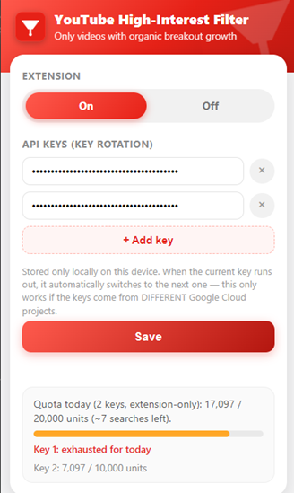

# YouTube Content Research Tool

Find **breakout video topics** from established YouTube channels — videos
whose view count significantly outperforms the channel's subscriber count,
which is a strong signal of a viral/trending topic worth studying.

Two ways to use it:
- **CLI tool** (`main.py`) — run a search from the terminal, get a table of results.
- **Browser extension** (`extension/`) — overlays the filtered results directly on youtube.com while you search. See [`extension/README.md`](extension/README.md) for extension-specific setup and usage.

<p align="center">
  
</p>

## 🎥 Demo

Watch the demo videos (presentation, API key setup, and a live search walkthrough):
[Google Drive folder](https://drive.google.com/drive/folders/16gBOkGv7wYI1ld6RiTO0lDYc2vCNjBTK)

## What it does

Given a keyword (e.g. `"fasting"`) or a channel name/handle, the tool finds
videos matching all of the following:

1. **No Shorts** — filtered by actual video duration, not by title text.
2. **Established channels only** — channel must have **≥100,000 subscribers**.
3. **Breakout performance** — views must exceed the channel's subscriber
   count (or be ≥1,000 for very small channels), i.e. the video clearly
   over-performed relative to the channel's usual reach.
4. **Recency, with automatic fallback** — tries the last 3 months first; if
   there are no results, automatically widens to 6 months, then 1 year,
   then no limit at all, stopping at the first tier with results.
5. **Sorted**: videos from the biggest channels first (by subscriber
   count), then the rest by `views / subscribers` ratio.

If the input matches an existing channel's exact name, handle (`@handle`),
or URL instead of a topic keyword, the tool switches to "channel mode" and
shows that channel's own top videos by views for the selected period
instead of doing a topic search. Channel name matching also transliterates
Cyrillic ⇄ Latin, so a query like `"милко атанасов"` correctly matches a
channel titled `"Milko Atanasov"` (and vice versa) instead of a different,
unrelated channel that happens to share the same name in the same script.

Built entirely on the **standard, public YouTube Data API v3** — no
partner/proprietary API access required.

### Key rotation

You can configure multiple API keys. When the active key hits its daily
quota, the tool automatically switches to the next one and retries the
same request — transparent to the caller. This only increases your total
effective quota if each key comes from a **different** Google Cloud
project (quota is enforced per-project, not per-key).

## Setup

### 1. Get a YouTube Data API v3 key

1. Go to [console.cloud.google.com](https://console.cloud.google.com) and sign in (requires 2-step verification enabled on the Google account).
2. Create a new project (or select an existing one).
3. **APIs & Services → Library** → search **"YouTube Data API v3"** → **Enable**.
4. **APIs & Services → Credentials** → **+ Create Credentials → API key**.
5. Copy the generated key. (Recommended: restrict it to "YouTube Data API v3" under API restrictions.)

> Free daily quota is 10,000 units. A typical search costs roughly 5–500
> units depending on how many candidates are scanned and whether the
> date-range fallback kicks in.

### 2. Install

```bash
pip install -r requirements.txt
cp .env.example .env
```

Open `.env` and set your key(s):

```
# Multiple keys enable key rotation (must be from different GCP projects
# to actually add up to a higher combined quota):
YOUTUBE_API_KEYS=key1_here,key2_here,key3_here

# Or a single key (backwards-compatible, used only if YOUTUBE_API_KEYS is absent):
# YOUTUBE_API_KEY=your_api_key_here
```

## CLI usage

```bash
python main.py "fasting"
python main.py "movement" --range 6m
python main.py "The Clashers"          # exact channel name -> channel mode
python main.py "@milkokukovbg"         # channel handle -> channel mode
```

`--range` options: `auto` (default — cascades 3m → 6m → 1y → all), `3m`,
`6m`, `1y`, `1y+` (older than 1 year), `all` (no date limit).

Output is a table with: Title, Channel, Subscribers, Views,
Views/Subscribers, Published, Video URL.

## Browser extension

The `extension/` folder contains a Chrome/Edge extension that applies the
exact same logic live on youtube.com's own search results page, plus a
per-key quota tracker, key rotation, and an on/off toggle. See
[`extension/README.md`](extension/README.md) for installation and usage
instructions.

## Project structure

```
main.py              CLI entry point
requirements.txt      Python dependencies
.env.example          Config template (copy to .env and add your API key)
youtube/
  api.py               YouTube Data API v3 client (batching, retry, quota errors)
  filters.py           Shorts detection, relevance & engagement rules
  models.py            VideoResult dataclass
  search.py            Orchestration: search -> filter -> sort, channel-mode detection, date cascade
  config.py            Settings (thresholds, API key loading)
extension/             Browser extension (see its own README)
```
